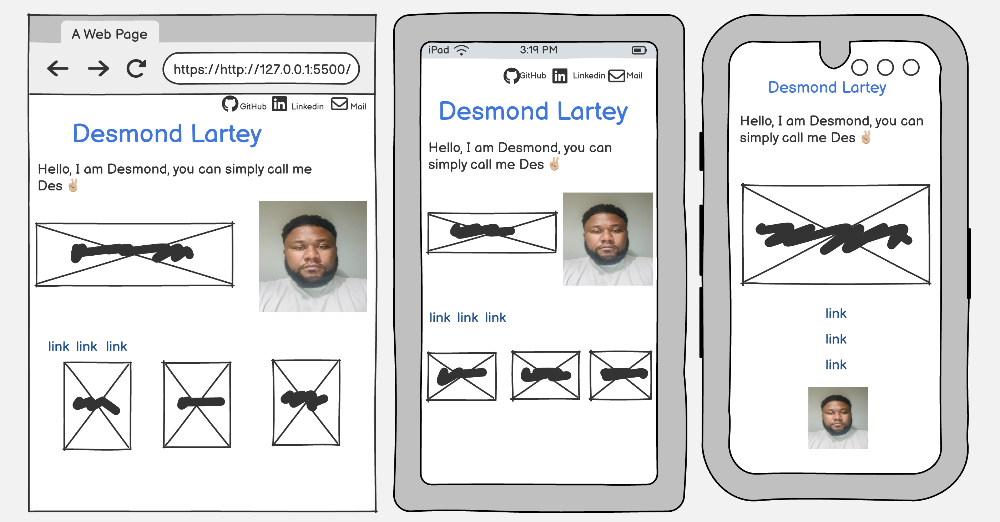
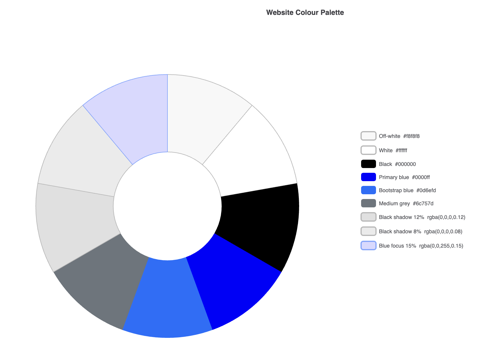
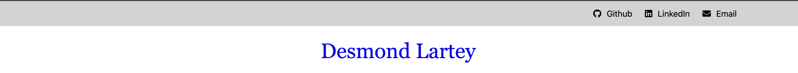
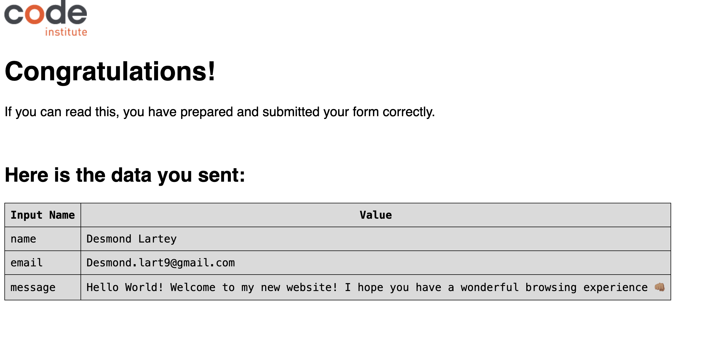
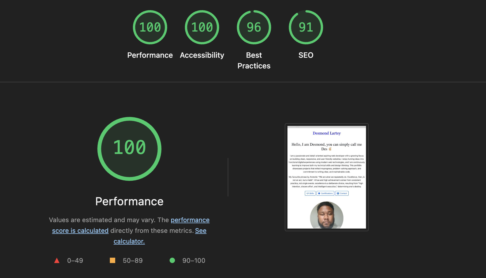
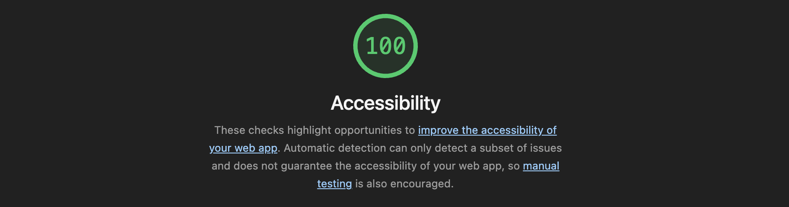
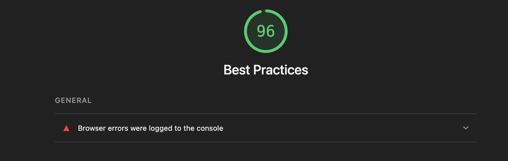

# First-Portfolio-Project

About:

This project is my first project, which is a personal portfolio project. It is a responsive website which highlights my personal ambition as a learner of web developer, my previous skills acquired, and a contact for collaboratopn.

The personal Portfolio Website is a beginner-friendly web development project designed to showcase my professional profile, qualificatin, and IT skills as an aspiring **Web Developer**

The main purpose of this project is to create a personal online presence where recruiters, visitors, and potential employers can learn more about me, my educational background, technical abilities, and future projects.
This website serves as:
1. A digital CV
2. A personal brand platform
3. A practical web development project to demonstrate my front-end development skills.

[View site](http://127.0.0.1:5500/First-Project---Personal-Portfolio-/index.html) Hosted on GitHub.

## Design & Planning:
### User Stories
1. ### **Homepage/Introduction**
   #### user Stories:
   - As a visitor, I want to see a clear introduction on the homepage/introduction so that I can quickly understand who the website belongs to.
   - As a visitor, I want to be able to open the website to view the owner's role or career ambition so that I know what kind of professional they are.

2. ### **About Me Section**
   #### User Stories:
   - As a visitor, I want to briefly read "About Me" section so that I can learn more about the person behind the portfolio.
   - As a recruiter, I want to understand the website owner's background and interest so that I can assess their suitability for opportunities.

3. ### **Skills Section**
   #### User Stories:
   - As a visitor, I want to see a list of technical and IT skills so that I can understand the website owner's capabilities.
   - As a recruiter, I want to identify the candidate's web development skills so that I can determine whether they match job requirements.

4. ### **Qualifications Section**
   #### User Stories:
   - As a visitor, I want to view the website owner's qualification so that i can understand their educational and professional background.
   - As a recruiter, I want to quickly find relevant certifications or training so that I can evaluate the candidate's learning and development.

5. ### **Contact Section**
   #### User Stories:
   - As a visitor, I want to find contact information about the owner so that I can easily get in touch.
   - As a recruiter, I want to access important links about the owner of the website such as linkedIn, Github, and Emails so that I can learn more about the professional profile and work of the candidate.

### Wireframes
The wireframes for this website were created using Balsamiq to develop a clear structural understnading. I established the mobile-first approach to ensure the website is responsive to all device formats and optimised.

#### Homepage/Introduction:

click to display

   

### Typography
When choosing the fonts for my website, I took into account readability, visual appeal, and how well they reflect the brand. As a result, I selected the following typefaces:
#### Primary Font - Times New Roman, Times, serif
- used for body text, paragraphs, headings, navigation and most of the website content.
- Clean, modern, and high clarity for mobile views.

#### Secondary Font - Gill Sans', 'Gill Sans MT', Calibri, 'Trebuchet MS', sans-serif
- Used as form input font.
- Simple, clean, neutral, and modern.

#### Colour Scheme
In deciding on the colour palette, I wanted to ensure it reflected the modern, professional, and accessible standards I had previould set. Hence, I chose the following colours.

click to display

The website made use of a neutral foundation of off-white, white and black, supported by blue accents for interactive elements. I used transparent colours to add subtle depth and provided visual feedback.

I used the 'off-white' for the main body and NavBar backgrounds. It provides a soft, neutral foundation that is less harsh than the pure white while maintaining strong contrast with the website's black text.

White was applied at the certification section, skill card and contrast form. It highlights these sections from the off-white background and presents the contents into a clear visual sections.

I used black for the main text, NavBar and navigation links. It provided a strong contrast against the light backgrounds to improve readability and create a professional appearance.

Primary blue was used for all the skills-cards borders and icons, form-field borders, navigation hover effects and input states. This colour was repeated to help users identify interactive and important interface elements.

Bootstrap blue was applied by the 'btn-outline-primary' class to the Skills, Certifications, Contact and Send Message buttons. It gives calls to action a consistent and recognisable appearance.

The medium grey was used on hovering the NavBar brand. It creates and subtle feedback without conflicting with the blue navigation links and buttons.

Transparent black 'rgba(0, 0, 0, 0.12)' was applied on all skill-card hover shadow. It provided a raised appearance of the card when a user points the cursor over it.

Transparent black 'rgba(0, 0, 0, 0.08)' is used around the contact form. It provides a lighter shadow that separates the form from the surrounding background while it maintains its distinctive and clean design. 

Transparent blue 'rgba(0, 0, 255, 0.15)' was applied to serve as a highlight around the selected form fields, making the active field easy to be identified and improves keyboard accessibility.

## Features:
### Site Wide Features:
#### Navigation
The website incorporates Bootstrap's responsive navbar component,allowing it to adapt smoothly to different screen sizes, from desktop devices to mobile devices. The navbar is divided into right and left bar - which the left bar represent the developer's full name, and the right bar representing links to GitHub, LindkedIn, and Email. The primary colour used here was a modern and clean font "Black." the right navbar are clickable to the developer's handles.

_Full size navigation bar:_
- Contains developer's full name on the middle.
- Contains links to developer's Github, LinkedIn, and Email accounts.

click to display

#### Hero Section/Introduction to the website
- Positioned at the top of the webpage and serves as the main introduction to the website. Contains key information about the purpose of the website, including the descriptive text, and a profile image.
- It contains interactive elements such as buttons, which edges users to explore more about the developer and the website as a whole. The layout is designed using a flexible structure to ensure it remains visually balanced and responsive across different screen size.

click to display

##### Skills Section 
This section highlights my core technical skills I am currently acquiring with Code Institute through Runshaw College. It is presented just underneath the hero/introduction section which is presented in a three-line row. 

click to display

##### Certification Section
The Certification Section is added to showcase my qualifications and accomplishments I have gained while developing my skills. The section displays certifications in a well-organised and structured way, which makes it easy for users to recognise my knowledge and areas of expetise. Its follows a simple and consistent typography, which improves readability and keeps it visually consistent with the rest of the website.  

click to display

##### Contact Page
The website provides a contact form that enables users to reach out to the developer - collaboration for professional and academic purposes.
- The correct for required is deployed to prevent users from submitting the form without the valid information.
- After a successful submission, the user is directed to the Code Institute formdump which displays a success message.

click to display

##### Success Page
Upon a successful submission of the contact form, there's a positive feedback to prevent the user from submitting multiple forms.
- The success message after submitting the form provide the user of a successful submission.
- This page is the Code Institute's form dump, which shows provide the user with a CONGRATULATIONS message to denote a successful submission.

click to display

##### Future Improvements
- In the future, I would like to provide further improvements on the responsiveness of the website, to ensure a smoother experience across a wider range of devices and screen sizes accordingly.
- I would also improve the optimisation of the website by compressing images and load times, for a faster and smoother user experience.
- In the future release, I would implement a refinement to the spacing, alignment, and the colour usage to create a more polished and cohesive design.

## Technologies Applied
- HTML
  - HTML was used as the main language for the structure of the website, and it was used to develop the structure of the website.
- CSS
  - Custom CSS was used to style the website.
- Visual Studio Code
  - Visual Studio Code was used to write, edit and manage the code used to developed the website.
- GitHub
  - Github was used to host the source code and deployed using Git pages.
- Git
  - Was used to commit and push code, during thedevelopment phase of the website.
- Font Awesome
  - Icons from font awesome were retrieved from https://fontawesome.com/ and used throughout the main section of this project.
- Favicon.io
  - Favicon files were obtained from https://favicon.io/favicon-converter/
- Balsamiq Wireframe
  - Wireframes were created from https://balsamiq.com/wireframes/desktop/# to visualise the website layout.
- Chat GPT
  - Used Chat GPT to turn rough notes into professional documentation.
  - To fixed grammatical error and formatting.
  - Presented clear explanations for easy understanding of concepts.
- Use.ai
  - I used Use.ai to identify errors in my HTML and CSS and suggested corrected code.
  - It provided Bootstrap classes, grid layouts, and media queries to improve the website on desktop, tablet, and mobile screens.
  - I utilised Use.ai to suggest colour combinations, typography, spacing, section backgrounds, and NavBar styling.

## Testing
### Google's Lighthouse Performance
#### Home Page

click to view

click to view

click to view

click to view

#### Form Dump Page

click to view

#### 404 Page

click to view

## Credits
- In the development of this project, I referenced back to Love Running and Walk-Through Projects for guidance and inspiration. Any re-used sections from the projects are credited in the source code through the comments.

### Contents
- Site Wide
  - Icons used were retrieved from [Font Awesome](https://fontawesome.com/)
  - All fonts used from [Google Fonts](https://fonts.google.com/)

- Home Page
  - Home page hero image by myself [My Gallery](images/AAA45F50-5559-44B8-B2F2-8281FE1DBEB2_1_105_c.jpeg)

- Acknowledgement
  - I would like to thank my tutor, Kevin, for his guidance and explanations throughout this project.

